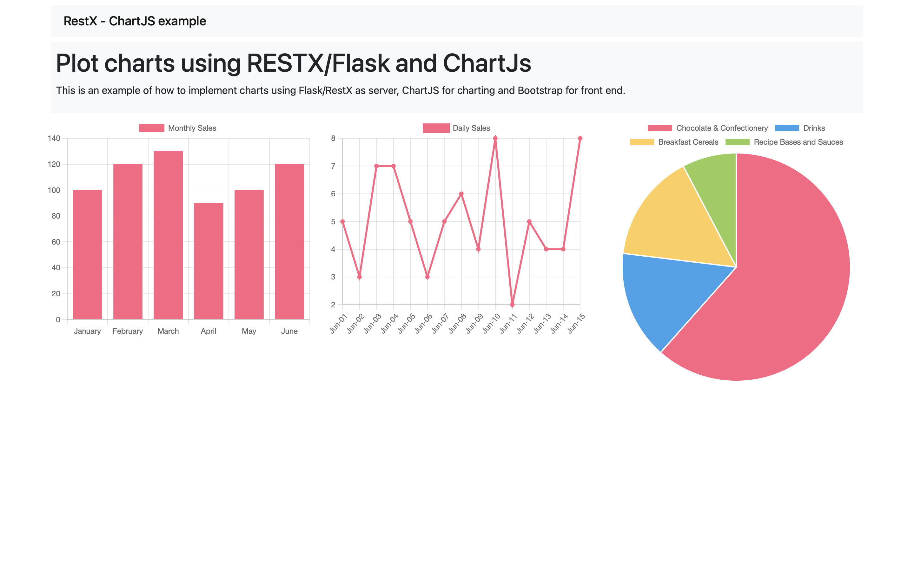

# How to plot charts in a flask app using Chart.js and Flask-RESTX

# Introduction

This is a sample code to showcase how to  plot charts in a Flask app. On the front end we are using [Bootstrap](https://getbootstrap.com/) for styling and [Chart.js][https://www.chartjs.org/] for implementing dynamic charts. Whereas in the backend we are using [Flask](https://flask.palletsprojects.com/en/2.1.x/) and [RESTX](https://flask-restx.readthedocs.io/en/latest/). RESTX is used to provide dynamic data required for charts using REST API. Where as Flask is used for serving the front page and loading the data from an external source using a custom cli command.

# How to use it

## Set up the environment

```bash
$ git clone https://github.com/app-generator/blog-sample-flask-charts.git
$ cd blog-sample-flask-charts
$ pip install -r requirements.txt
```

On Linux/Unix

```bash
$ export FLASK_APP=app
$ flask load-data
Added 13 records in MonthlyCustomers
Added 13 records in MonthlySales
Added 6 records in ProductSales
$ flask run
* Serving Flask app 'app' (lazy loading)
* Environment: production
WARNING: This is a development server. Do not use it in a production deployment.
Use a production WSGI server instead.
* Debug mode: off
* Running on http://127.0.0.1:5000 (Press CTRL+C to quit)
```
On Windows CMD

```bash
> set FLASK_APP=app
> flask load-data
Successfully fetched the data.
Saved data to data/dataset.json
> flask run
* Serving Flask app 'app' (lazy loading)
* Environment: production
WARNING: This is a development server. Do not use it in a production deployment.
Use a production WSGI server instead.
* Debug mode: off
* Running on http://127.0.0.1:5000 (Press CTRL+C to quit)
 ```

Now go to url - http://127.0.0.1:5000 using any browser. It will load the example as below-




---
Flask Charts via Flask-RestX - provided by [AppSeed](https://appseed.us)
